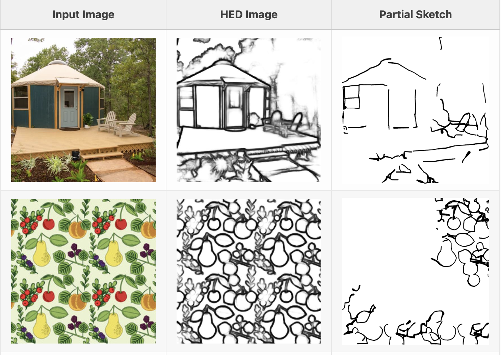
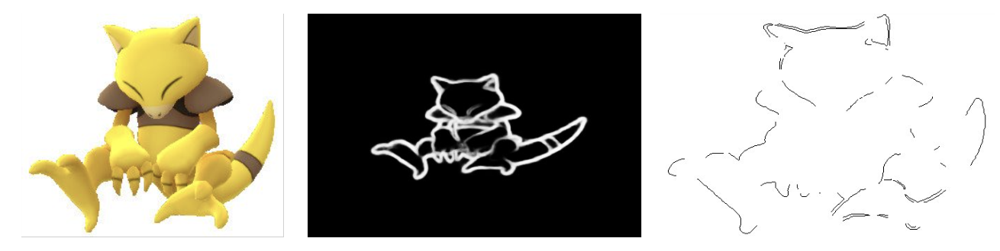

This is an ongoing side little fun project.

If you are willing to collaborate just open an issue, I will respond.

The project is inspired from Sketch-a-Sketch paper. See the details [here](https://vsanimator.github.io/sketchasketch/).

# Generate Partial Sketch 

To generate partial sketch, see the sketch-a-sketch paper approach. It utilizes holistic edge detection (HED). The implementation of HED is taken from [here](https://github.com/sniklaus/pytorch-hed).

Implementation of HED on a sample image of an Abra:  

# Tasks

1. Setup data generation pipeline - [x]
2. Test on stable diffusion2 sketch model version. - [x]
3. Annotate text description for each RGB image
4. Finalize diffusion architecture
5. Finetune architecture models with stable diffusion 2.

